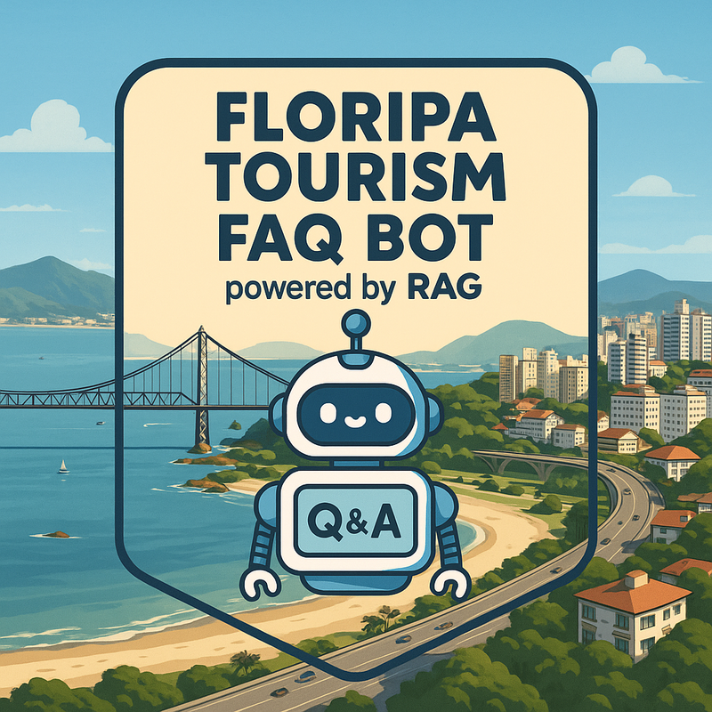
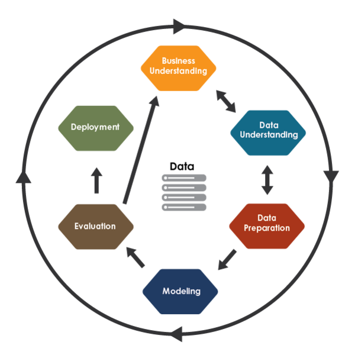
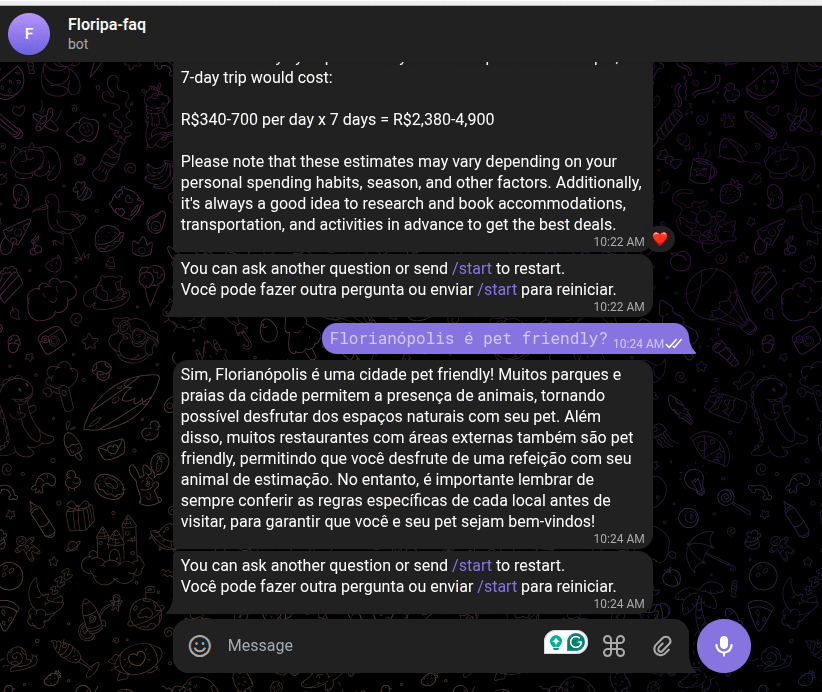

# FAQ-Floripa: A Smart Tourism Assistant Powered by RAG



## Business Understanding

**What problem are we solving?**

Travelers often arrive at a destination without clear answers to basic questions:

> *“What are the best beaches for families?”*
> *“What can I do on a rainy day in Floripa?”*
> *“Is there public transport to Campeche?”*

This project builds an intelligent assistant that helps answer those questions by combining a **large language model (LLM)** with a **custom knowledge base** tailored to **Florianópolis tourism** — using a **Retrieval-Augmented Generation (RAG)** architecture.

---

## Problem Understanding

Traditional travel chatbots either:

- Provide generic information not tailored to the location
- Require hardcoded answers, which become outdated quickly

> We address this gap by building a **Retrieval-Augmented Generation (RAG) assistant**, grounded in an expanding **FAQ knowledge base** related to tourism in Florianópolis. The system uses **dense vector retrieval** to identify the most semantically relevant content for each user query. This retrieved information is then passed to a **language model**, which refines and contextualizes the answer to produce high-quality, human-like responses. This architecture ensures that tourists receive accurate, up-to-date, and context-aware recommendations — significantly enhancing their travel experience.

## Project Cycle



**Step 01: Business Understanding**
Focus on the needs of travelers in Florianópolis. What are their most common questions? What makes their experience better?

**Step 02: Data Understanding**

To enable early testing of the retrieval system, we generated a synthetic dataset in JSON format, containing representative user queries and corresponding answers.

**Step 03: Data Preparation**
Clean and generate vector embeddings for similarity search.

**Step 04: Modelling**
Use a vector database (e.g., FAISS) to retrieve relevant information and generate answers using an LLM.

**Step 05: Evaluation**
Test relevance, and usefulness of responses. Use real user scenarios for validation.

**Step 06: Deployment**
Deploy the system as a Telegram bot inside a Docker container. Easily customizable for other cities.

**Step 07: Feedback Loop**
Iterate based on user interactions and new tourist materials. Improve the experience constantly.

---

## Business Solution

- Available on Telegram
- Answers tourist questions in natural language (PT/EN)
- Suggests places, and activities
- Uses modern NLP techniques to keep answers updated and relevant
- Easily adaptable to other tourist destinations

---

## Results and Conclusions

- Working prototype deployed with Docker and Poetry
- Answers tested with real travel-related questions
- RAG architecture ensures personalized, relevant responses
- Potential for scale-up and integration with live data

---

### Lessons Learned

- Initially, I implemented a custom class for the retrieval component, handling vector search and document ranking manually.
- While this worked, I realized that using a framework like **LangChain** would have provided better modularity, scalability, and community support for Retrieval-Augmented Generation (RAG) pipelines.
- Going forward, I plan to refactor this architecture to integrate LangChain's abstraction layers, improving maintainability and experimentation speed with different retrievers and prompt strategies.

---

### Roadmap & Improvements

- **Cloud Deployment**: Host the application in a cloud environment to ensure high availability (24/7 access) and scalability.
- **Knowledge Base Expansion**: Continuously enhance the database with data from multiple trusted tourism sources to enrich answer quality and coverage.
- **Low-Similarity Logging**: Implement a logging mechanism to store all user queries with low similarity scores, enabling future manual or automated inclusion into the knowledge base.
- **Retrieval Optimization**: Refine the retrieval pipeline for more accurate matching, potentially integrating advanced frameworks like LangChain in future iterations.

---

## Demonstrations

Here is a quick demo of the Telegram assistant in action:



---

## Project Structure

* `faq-floripa/`
  * `src/`: Core source code (retriever, bot logic, etc.)
  * `data/`: Input data JSON
  * `img/`: Images and GIFs used in README
  * `pyproject.toml`: Poetry dependencies
  * `Dockerfile`: Container setup
  * `README.md`

---

## ⚙️ How to Use

1. Clone the repository
2. Configure your `.env` with OpenAI API key and Telegram Bot Token
3. Install dependencies via Poetry
4. Build and run the container with Docker

```bash
# build the image
sudo docker build -t faq-floripa .

# run the bot in detached mode
sudo docker run -d --name faq-bot faq-floripa 
                                              
```


## 👤 Author

**Thiago Guimarães**

* 🌐 [LinkedIn](https://www.linkedin.com/in/thiagodatascientist/)
* 📧 Email: [thiago.guimaraes.sto@gmail.com](mailto:thiago.guimaraes.sto@gmail.com)
* 📱 WhatsApp: [+55 48 99673-7618](wa.me/5548996737618)
